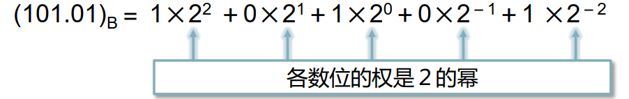
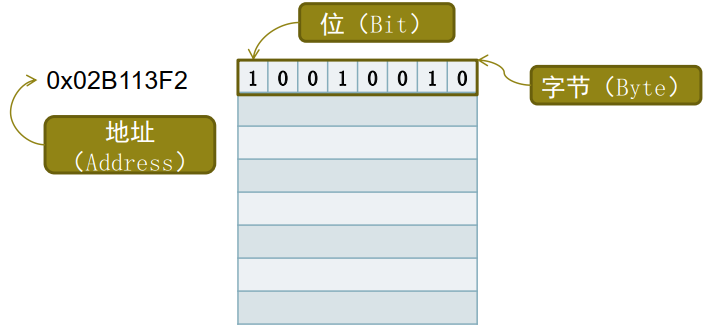
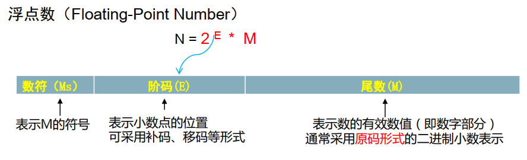
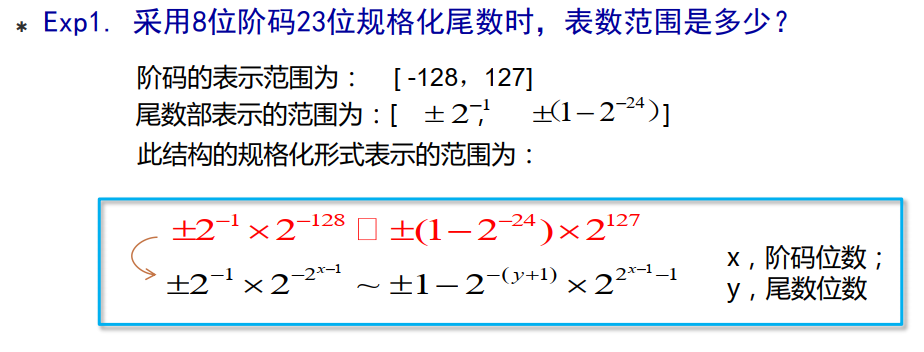
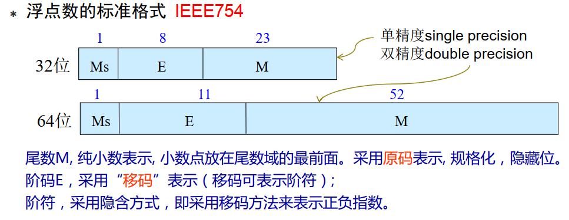

## 数据的表示和存储


### 二进制数


#### 什么是二进制

1. 二进制数的数码只有两个：`0`和`1`

2. 基数：`2`

3. 运算规律：逢二进一，借一当二

4. 二进制的权展开式

   

   

5. 这实际上和十进制是类似的


#### 二进制数的运算规则


##### 加法规则

`0 + 0 = 0`, `0 + 1 = 1`, `1 + 0 = 1`, `1 + 1 = 10`


##### 乘法规则

`0 * 0 = 0`, `0 * 1 = 0`, `1 * 0 = 0`, `1 * 1 = 1`


#### 为什么计算机使用二进制而不是十进制来存储数据

1. 二进制数只有`0`和`1`两个数码，它的每一位都可以用电子元件来实现
2. 二进制数的运算规则简单，且其相应的运算电路容易实现


#### 二进制如何表示一个负数

1. 一个负数在二进制中是使用它的补码形式来表示的

2. 由原码计算补码

   - 例如`-1`用一个字节进行存储的原码为

     `1 0000001`

   - 其中最高位为符号位，`0`表示正，`1`表示负

   - `-1`的反码就是将`-1`的原码除了符号位，其余位都按位取反。如下

     `1 1111110`

   - 补码就是在反码的基础上加`1`。例如`-1`的补码如下

     `1 1111110 + 0 0000001 = 1 1111111` 

3. 而负数为什么要使用补码进行表示呢？

   - 先看一个例子

   ```c
   //首先我们都知道
   1 - 1 = 0;
   //上面的式子又等价于
   1 + (-1) = 0;
   //也就是说，一个数减去它自己，相当于用它自己去加上自己的相反数
   //并且其结果为0
   //同样，我们在使用二进制的时候，也在想，能否设计一种编码方式来表示一个负数
   //使得正数和负数的加法能够产生上面的效果
   //这时候我们反过来考虑
   -1 = 0 - 1;
   //转化为二进制
   1 xxxxxxx = 0 0000000 - 0 0000001;
   //由于0 - 1不够减，因此我们考虑向高位借1。我们假设
   1 xxxxxxx = (1)0 0000000 - 0 0000001;
   //结果为
   1 xxxxxxx = (1)0 0000000 - 0 0000001 = 1 1111111;
   //如果我们用 1 1111111表示-1，那么
   1 - 1;
   //相当于
   1 + (-1);
   //相当于
   0 0000001 + 1 1111111 = (1)0 0000000;
   //将最高位丢弃，所得结果就为0
   ```

   

   - 实际上，对于二进制的负数使用补码进行表示的理念和上面的例子的理念类似
   - 由于计算机通常只有加法器，因此减法实际上最后也是转变为加法进行运算的
   - 就相当于对于减法，我们可以转化为加上一个要减的数的相反数
   - **使用补码表示一个负数，使得任意两个==有符号整数==的加法运算可以像没有符号的运算那样简单，不用考虑符号位的问题，从而提高了运算的效率**

4. 补码的比较正规的理念大概如下

   - 对于有符号整数，使用最高位作为符号位，`0`表示正数，`1`表示负数
   - 然后要求表示互为相反数的两个数相加结果为`0`
   - 我们可以将一个存储空间和时钟类比，将其看成是一个环
   - 假设时钟的时针指向的是`0`点，我们现在要调到`1`点
   - 我们可以将其顺时针拨`1`个格子，也可以逆时针拨`12-1 = 11`个格子
   - 对于超过`12`点的时间，可以对`12`取余然后获得其在时钟上的表示。比如说`13`点，`13 % 12 = 1`，那么就可以使用`1`表示`13` 。这时候只要我们增加一个标记，就能够使用只有`12`个数字的时钟表示`24`个小时。只要在时间前面加上一个`AM`表示上午，也就是不超过`12`点的时间，同理使用`PM`表示下午
   - 而对于二进制也是这样的原理，只要拿出一位用来表示符号位，那么该存储空间中的数字就可以表示正数，又可以表示负数了。这就类似于`AM`和`PM`。
   - 然后对于余下的位，就是用来表示具体数字的。那么这些位所能表示的数值绝对值的最大值加上`1`，就和时钟的`12`类似。例如，对于一个字节的空间，除去符号位，只有`7`位可以用来表示数，其最大值为`（1111111）`~B~ `= 127`。其模就是`128`，因此该空间能表示的最大整数是`127`,最小的整数是`-127`
   - 我们可以观察到，时钟的`12`既可以表示`12`点，也可以表示`0`点，这主要取决于我们的看法
   - 而对于`1`点，我们可以从`12`或者说`0`那里通过顺时针拨`1`格，也可以逆时针拨`11`格。而`1 + 11 = 12(0)`
   - 补码就借鉴了这样的一种理念：以一个字节为例，`128 - 1 = 127` -> `10 00 00 00 - (0)0 00 00 01 = (0)1 11 11 11`，我们可以使用`(-)127` -> `(1)1 11 11 11`作为`-1`的编码，因为如果使用`(-)127`作为`-1`的编码，那么对于`1 - 1` -> `1 + (-1)` -> `(0)0 00 00 01 + (1)1 11 11 11 = [1] (0)0 00 00 00`。即两数相减可以转化为两数相加，并且相加过程中的符号位也是直接进行相加，或者换句话说，计算过程中符号位和其他位一样，不需要进行特别对待。对于结果的溢出位直接丢弃，其余的位数就是最终的结果。比如说上面的`1 - 1`的运算结果为`[1] (0)0 00 00 00`，那么，我们只需要将溢出的`[1]`直接丢弃，其后的`(0)0 00 00 00`就是最终的结果，而最终的结果的最高位依然是符号位，`0`表示正数，`1`表示负数。
   - **综上，负数使用补码的形式进行表示和存储，实际上就是为了方便计算机将减法直接转变为加法运算，同时在进行加法运算时不用考虑符号位**。

5. 根据4的推导，我们可以获得两个比较具有理解性且便于记忆的求一个负数的补码的方法

   - *方法1*

   ```c
   //以一个字节为例，求-2的补码
   
   //1.计算该内存空间的所能表示的整数的个数，对于一个字节就是8位
   //最多能表示2^8 = 256个数
   //这个数实际上就是[1] 00 00 00 00 -> 0
   
   //2.使用0减去任何一个数，其结果就是该数的相反数
   //0 - 2 = -2
   //[1] 00 00 00 00(0) - 00 00 00 10(2) = 11 11 11 10(-2)
   
   //3.上面所得的结果11 11 11 10 就是-2的补码
   
   //4.实际上，步骤1就是为了求出一个溢出的0值，溢出的位数1用于给后面借位
   ```

   

   - *方法2*

   ```c
   //以一个字节为例，求-2的补码
   
   //1.一个字节最高位为符号位，其余7位为表数的位，所以这7位的模数为2^7 = 128
   
   //2.求2的互补数（也就是和2相加的和为模数128的数），设为x
   //则有 x + 2 = 128 -> x = 128 -2 = 126
   
   //3.则-2的补码就是其相反数2的互补数126的相反数-126
   //-126的二进制表示为：11 11 11 10
   
   //4.因此11 11 11 10就是-2的补码
   ```

   

6. **总之，将负数的二进制存储表示为其补码形式，实际上就是为了能够使得二进制的减法能够像十进制的一样**。对于互为相反数的两个数的二进制的加法结果为`0`。**经过这样的设计，就能够使得对于二进制的就算更加简单高效，使得二进制加法计算忽略符号位的特殊性，而和我们常用的十进制的运算很相似**

7. 对于上面的分析，其实我们可以发现，上面这样的设计会导致表示`0`的形式不唯一。对于上面一个字节的情形，`00 00 00 00`和`10 00 00 00`都表示`0`，为了使得`0`的表示是唯一的，这里认为地规定`10 00 00 00`为`-128`，这样，`0`的表示就唯一了。也就是对于一个内存空间的最高为`1`，其余都为`0`的情形，规定这个二进制表示的是这个二进制对应的十进制数的相反数（是一个负数）。

------


### 数据与内存


#### 计算机内存的组织方式

1. 计算机的内存的单元是==字节==。一个字节==8位==
2. 内存是一种存储单元的一维结构。如下所示




#### 字和字长

1. 计算机中CPU读取内存中的数据不是一个字节一个字节地读取的
2. 每次读取一串数码，每次将这一串数码作为一个整体来进行处理和运算
3. CPU每次从内存中读取的数码串称为==*计算机字*==，简称字
4. 这样的一个数码串长度称为==字长==
5. 实际上，CPU从内存中读取数据是将其读取到CPU上的寄存器中。因此，字长实际上就是CPU上的寄存器的容量大小。通常寄存器的大小和`int`类型所占用的内存大小相同


#### 浮点数的表示










#### 是否所有的小数都能用二进制精确表示

1. 二进制小数和十进制小数之间并不是一一对应的关系
2. 一个二进制小数一定对应一个十进制小数
3. 但是，一个十进制小数却不一定刚好有一个二进制小数与之对应
4. 因此，计算机中的浮点数只是对实数的==一个近似表示==


### END

