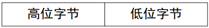
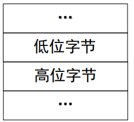
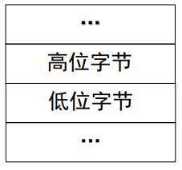
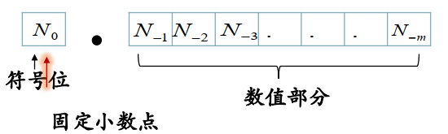
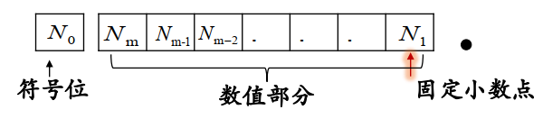

## 变量的类型决定了什么

### 高级语言为什么要区分数据类型

1. 为了更有效地组织数据，规范数据的使用
2. 有助于提高程序的可读性，方便用户使用

### 在程序设计语言中引入数据类型的好处

1. 带来了程序的简明性和数据的可靠性。
2. 有助于提高程序的执行效率，节省内存空间

### C语言的数据类型

#### 基本类型

1. 整型
   - 基本整型： `int`
   - 长整型： `long`
   - 短整型：`short`
   - 无符号整型：在前面三种整型数据类型之前增加一个`unsigned`关键字，就变为相应的无符号整型
2. 实型（浮点型）
   - 单精度实型：`float`
   - 双精度实型：`double`
   - 长双精度实型：`long double`
3. 字符型
4. 枚举类型

#### 构造类型

1. **数组类型**
2. **结构体类型**
3. **共用体（联合）类型**

#### 指针类型和空类型

### 变量的类型决定了什么

1. 占用空间的大小
2. 数据的存储形式
3. 合法的表数范围
4. 可参与的运算种类

#### 不同类型的变量占用的内存不同

##### 整型

1. `int`： 基本整型
   - 对于其占用的内存空间，C标准并没有规定，这和系统有关，和计算机的字长有关，通常`int`类型所占用内存的大小为==一个字长==。目前的大多数系统上`int`占用4个字节。
2. `short int`，简写为`short`： 短整型
   - 占用==2字节==
3. `long int`, 简写为`long`： 长整型
   - 占用==4字节==
4. `unsigned`： 无符号整型（正整数和0）
   - 用来修饰`int`, `short`和`long`

##### 实型

1. `float`： 单精度实型

   - 占用==4个字节==

2. `double`： 双精度实型

   占用==8字节==

3. `long double`： 长双精度实型

   - `IEEE`规定为10字节，但是实际上很多编译器没有遵循这一规则，所以这个类型的变量占用的内存也是和系统相关

##### 字符型

`char`： 字符型

- ​	占用==1字节==

##### 注意

由上面的内容可知，C语言中，有的类型的变量所占用的字节数是和系统相关的，因此==绝不能对于变量所占用的内存字节数想当然==

##### 如何计算变量或类型所占内存的大小

###### 使用`sizeof`运算符

1. `sizeof`运算符是一个一元运算符，用于计算变量或类型占用内存的大小

2. 语法

   |        语法形式        |                       运算结果                       |
   | :--------------------: | :--------------------------------------------------: |
   |    `sizeof(类型名)`    |     这种类型的变量在内存中所占用的内存==字节数==     |
   | `sizeof(变量或表达式)` | ==变量或者是表达式的结果==所属类型所占用的内存字节数 |

###### `sizeof`运算符的好处

1. 增加程序的可移植性
2. `sizeof`运算符是==编译时执行==的运算符，所以使用该运算符不会导致程序运行时间的额外开销

#### 不同类型的数据表数范围不同

1. 不同类型的表数范围不同
2. 有符号和无符号类型的表数范围也不同
   - ==有符号整数==的最高位为符号位
   - ==无符号整数==的最高位为数据位
   - 有符号整数所能表示的最大整数仅为无符号整数所能表示的最大整数的==一半==

#### 不同类型数据的存储形式不同

##### 整型数

1. 以`short`类型（占用2字节）为例

2. 一个`short`类型的数据使用二进制表示如下

   
   

   
3. 由于计算机的内存是一维线性排列的，并且一个单元为一个字节

4. 因此，将这样的一个2字节的数据存放到内存中就有两种存储的方式

5. ==小端次序==

   - 存放形式如下

     

     

   - 这种存放形式的好处

     - 便于计算机从低位字节向高位字节进行运算

6. ==大端次序==

   - 存放形式

     

   - 好处

     - 与人们从左到右的书写顺序相同，便于对字符串的处理

##### 实型数

1. 如何存储一个实型数的关键是==确定小数点的位置==

2. 实型数的表示方法

   - 小数形式
   - 指数形式，也就是科学计数法

3. 只有小数部分或者只有整数部分的实型数成为==定点数==

   - 定点数的小数点位置固定
   - 只有整数部分的定点数叫做==定点整数==
   - 只有小数部分的定点数称为==定点小数（纯小数）==

4. 定点数的表示

   - 定点数通常用==小数形式==来进行表示

   - 定点小数：小数点位于符号位和最高数值位之间

     

   - 定点整数：小数点位于数值位的最低位

     

5. 小数点位置不固定的实型数称为==浮点数==

6. 浮点数以科学计数法的方式表示，这样就可以分别用一些位表示指数部分和小数部分

7. 浮点数实现小数点位置浮动的原理

   - 将实数拆分为==阶码(Exponent)==和==尾数(Mantissa)==两个部分分别进行存储。如下图所示

     

   - 对于同样的尾数，阶码的值越大，则浮点数所表示的数值就越大

   - 对于同样大小的存储单元，用于存储阶码的位数越多，则能表数的范围就越大，但是相应的用于存储尾数的位就变少了，这时候表数的精度就会变差

8. 在计算机中，通常用==定点数==来表示整数和纯小数；而用==浮点数==来表示既有整数又有小数的实数

##### 字符型数据

1. 字符型数据是指那些英文字母、数字以及控制字符等
2. 在C语言中，字符型数据以二进制编码的形式进行存储，一个字节保存一个字符
3. 字符的编码方式
   - 取决于计算机系统所采用的字符集
   - `ASCII`字符集是一个我们常用的字符集
   - 根据字符集，每一个字符具有一个编码值，这个值可以使用二进制的整数进行表示
   - 因此，一个字符常数，实际上就是一个普通的整数

#### 不同的数据类型可参与的运算不同

##### 整型

加减乘除和取余

##### 实型

加减乘除

##### 字符型

1. 加减
2. 对于字符型数据的运算，实际上是对表示字符的整数进行运算。对于`ASCII`字符集，也就是对字符的`ASCII`值的运算

##### 指针类型

加减和比较运算

